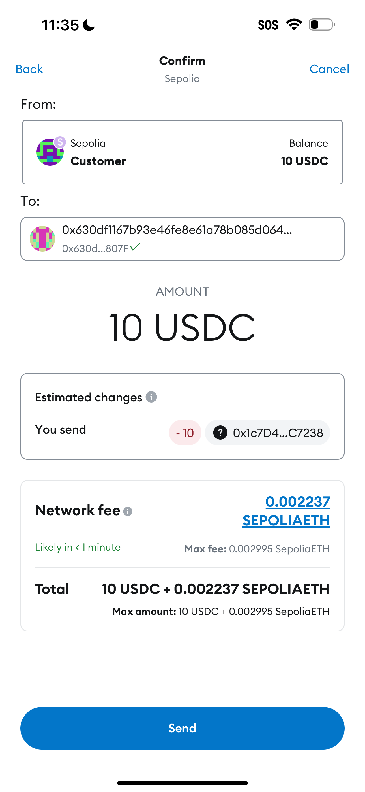

# spendcodes

## deploy

```
forge script script/DeployMerchantPayment.s.sol:DeployMerchantPayment --rpc-url sepolia --broadcast --verify -vvvv
```

### test

```
forge script script/GenerateQRCode.s.sol:GenerateQRCode --rpc-url $SEPOLIA_RPC_URL -vvvv
```



[txn hash](https://sepolia.etherscan.io/tx/0xac709b9affd36a13f42e969ab457ad5e4bb2342b2c5e6a78720e17dbf702327a)
